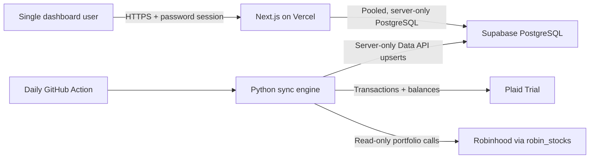

# Free Finance

Free Finance is an ultra-low-cost, single-tenant personal finance dashboard that
you deploy into accounts you control. It combines a Next.js dashboard on Vercel,
PostgreSQL on Supabase, and a small Python sync job on GitHub Actions.

The first supported data sources are:

- Bank of America through Plaid Transactions and Balance
- Robinhood stocks and crypto through the community-maintained `robin_stocks`
  package

The target operating cost is **$0/month while the project remains within each
provider's free-tier limits**. Provider limits and terms can change, so check the
linked official pricing and plan pages before relying on that target.

> [!IMPORTANT]
> This repository is for a private, single-user deployment. It handles financial
> data and credentials that can access real accounts. Keep the repository private,
> use unique secrets, enable MFA on every provider, and never expose a value from
> `.env.local` to browser code.

## Project status

The initial end-to-end implementation is complete:

- [x] Step 1 — setup guide and environment contract
- [x] Step 2 — PostgreSQL schema, RLS, indexes, and Drizzle migrations
- [x] Step 3 — Plaid/Robinhood Python sync and GitHub Actions workflow
- [x] Step 4 — authenticated Next.js dashboard, charts, theme, and setup status

The dashboard is intentionally empty until a provider completes its first sync.

## Architecture



The boundaries are intentional:

- Vercel receives only the database runtime URL and dashboard authentication
  secrets. It does not need bank or brokerage credentials.
- GitHub Actions receives the Plaid, Robinhood, and Supabase sync secrets.
- Browser code receives no financial-provider or database secrets.
- Drizzle uses Supabase's transaction pooler for short-lived Vercel functions.
- The Python job uses the Supabase Data API with a server-only secret key. This
  avoids direct PostgreSQL networking from ephemeral GitHub runners.
- Sync operations are idempotent upserts. A retry should update the same source
  records rather than create duplicates.

## Technology choices

| Layer | Choice | Reason |
| --- | --- | --- |
| Web | Next.js App Router + TypeScript | Server Components keep database access off the client |
| UI | Tailwind CSS + shadcn/ui | Small, local component surface with no hosted UI dependency |
| Charts | Recharts | Flexible charts without a paid service |
| Database | Supabase PostgreSQL | Managed PostgreSQL with a practical free tier |
| ORM | Drizzle ORM | Small SQL-first runtime and straightforward migrations |
| Sync | Python 3.12+ | First-class Plaid and `robin_stocks` libraries |
| Scheduler | GitHub Actions | A daily job uses very little Actions time |
| Hosting | Vercel | Zero-configuration Next.js deployments |

## Prerequisites

Create free accounts for:

- [GitHub](https://github.com/)
- [Supabase](https://database.new/)
- [Vercel](https://vercel.com/signup)
- [Plaid](https://dashboard.plaid.com/signup)

Install locally:

- Git
- Node.js 22 LTS or newer
- pnpm through Corepack
- Python 3.12 or newer
- GitHub CLI, optional but convenient
- Plaid CLI, optional for inspecting Plaid data

On macOS, the optional CLIs can be installed with:

```bash
brew install gh
brew install plaid/plaid-cli/plaid
```

## 1. Prepare local configuration

Clone your private repository, then create the untracked local environment file:

```bash
git clone <your-private-repository-url>
cd free-finance
cp .env.example .env.local
```

Generate a cookie-signing secret:

```bash
openssl rand -hex 32
```

Paste the result into `SESSION_SECRET` in `.env.local`. Choose a unique dashboard
password of at least 16 characters for `DASHBOARD_PASSWORD`. Both variables are
server-only; neither may use the `NEXT_PUBLIC_` prefix.

The committed `.gitignore` excludes `.env.local`, Python virtual environments,
Robinhood session files, and Vercel's local project metadata.

## 2. Create the Supabase database

1. Open the [Supabase dashboard](https://database.new/) and create a project on
   the Free plan.
2. Choose the region nearest the Vercel region you expect to use.
3. Generate a strong database password and save it in a password manager. It is
   needed for both connection URLs.
4. Wait for the project to finish provisioning, then click **Connect** in the
   project dashboard.
5. Copy the **Transaction pooler** URI, which normally uses port `6543`, into
   `DATABASE_URL`.
6. Copy the **Session pooler** URI, which normally uses port `5432`, into
   `DATABASE_MIGRATION_URL`. The session pooler works from IPv4-only networks and
   supports migration tooling.
7. Open **Project Settings → API Keys**:
   - Copy the project URL into `SUPABASE_URL`.
   - Create or copy a server-side **Secret key** (`sb_secret_...`) into
     `SUPABASE_SECRET_KEY`.
   - If the project only exposes legacy keys, the legacy `service_role` value can
     be used temporarily in `SUPABASE_SECRET_KEY`.

Supabase recommends a transaction-mode pooler for temporary serverless
connections. Transaction mode does not support prepared statements, so the
Drizzle client added in Step 2 will explicitly disable them. See
[Supabase's connection guide](https://supabase.com/docs/guides/database/connecting-to-postgres)
and [API-key guide](https://supabase.com/docs/guides/getting-started/api-keys).

> [!CAUTION]
> `DATABASE_URL`, `DATABASE_MIGRATION_URL`, and `SUPABASE_SECRET_KEY` all grant
> privileged data access. The `sb_secret_...` and legacy `service_role` keys
> bypass Row Level Security. Never put them in a `NEXT_PUBLIC_` variable, browser
> component, screenshot, issue, or build log.

Create the tables:

```bash
corepack enable
pnpm install
pnpm db:migrate
```

Run migrations locally with `DATABASE_MIGRATION_URL`; do not run migrations in
every Vercel build or every daily sync.

## 3. Set up Plaid Trial and connect Bank of America

Plaid's current Trial plan provides free production API access for eligible
developers in the United States and Canada. It includes Transactions and Balance,
supports Bank of America OAuth, and allows up to 10 lifetime production Items.
Removing an Item does not return its slot. Review
[Plaid's Trial-plan details](https://support.plaid.com/hc/en-us/articles/39994173227159-What-is-the-Plaid-Trial-plan)
before creating test production Items.

### Start in Sandbox

1. Sign in to the [Plaid Dashboard](https://dashboard.plaid.com/).
2. Copy the client ID and Sandbox secret into:

   ```dotenv
   PLAID_CLIENT_ID=...
   PLAID_SECRET=...
   PLAID_ENV=sandbox
   ```

3. Run the Plaid linking helper to create a Sandbox Item and write its
   access token to `.env.local`.
4. Run a manual sync and confirm that sample accounts and transactions reach
   Supabase before using a real account.

Sandbox Items cannot be moved to Production. They are disposable test data.

### Request Trial and connect Bank of America

1. From the Plaid Dashboard, apply for the **Trial** plan and complete identity
   verification. The optional Plaid CLI command `plaid trial` opens the same
   application.
2. Wait for approval. Plaid says major-institution OAuth access commonly becomes
   available 6–24 hours after approval.
3. Fetch or copy the **Production** secret. With the Plaid CLI:

   ```bash
   plaid login
   plaid keys fetch
   plaid config set --env production
   ```

4. Update local configuration:

   ```dotenv
   PLAID_ENV=production
   PLAID_CLIENT_ID=<your-client-id>
   PLAID_SECRET=<your-production-secret>
   ```

5. Run:

   ```bash
   .venv/bin/python scripts/plaid_link.py --github
   ```

   The helper will create a Hosted Link session, open it in a browser, let you
   select Bank of America, exchange the one-time public token on the local
   machine, save the resulting `PLAID_ACCESS_TOKEN` only to `.env.local`, and
   securely send it to GitHub Actions over standard input. Omit `--github` if
   GitHub CLI is not authenticated yet.

6. Confirm the connection without printing the access token:

   ```bash
   python scripts/sync.py --source plaid --dry-run
   ```

Plaid access tokens are long-lived credentials and must remain server-side. Plaid
documents the supported variables and environment names in its
[CLI guide](https://plaid.com/docs/resources/cli/) and the token exchange in its
[Link API guide](https://plaid.com/docs/api/link/).

## 4. Configure Robinhood read-only sync

`robin_stocks` uses Robinhood's private, undocumented API. It is not an official
Robinhood integration, and login behavior can change without notice. This project
will call portfolio and holdings endpoints only; it will not include buy, sell,
transfer, or cancel-order operations.

1. Enable two-factor authentication on the Robinhood account.
2. Choose an authenticator-app/TOTP method. If Robinhood offers an **Other**
   authenticator option, save the alphanumeric TOTP seed in a password manager
   before finishing setup.
3. Add the following only to `.env.local` and GitHub Actions secrets:

   ```dotenv
   ROBINHOOD_USERNAME=<account-email>
   ROBINHOOD_PASSWORD=<account-password>
   ROBINHOOD_TOTP_SECRET=<alphanumeric-totp-seed>
   ```

4. Test locally:

   ```bash
   python scripts/sync.py --source robinhood --dry-run
   ```

The TOTP seed can generate valid MFA codes and is as sensitive as the password.
Do not store a one-time six-digit MFA code; it expires too quickly for scheduled
jobs. The `robin_stocks`
[TOTP setup guide](https://robin-stocks.readthedocs.io/en/latest/quickstart.html#with-mfa-entered-programmatically-from-time-based-one-time-password-totp)
shows how the seed is used.

> [!WARNING]
> Robinhood may require a phone approval, CAPTCHA, password reset, or new-device
> verification even when TOTP is configured. If that happens, the daily job
> cannot solve the challenge. Step 3 will preserve successful Plaid work, avoid
> partial Robinhood writes, report the source failure clearly, and exit
> unsuccessfully so GitHub can notify you.

Robinhood is optional. Leave all three `ROBINHOOD_*` values empty to skip that
source.

## 5. Add GitHub Actions secrets

Keep the repository private. On GitHub, open:

**Repository → Settings → Secrets and variables → Actions**

Create these **repository secrets**:

| Secret | Required | Source |
| --- | --- | --- |
| `SUPABASE_URL` | Yes | Supabase project URL |
| `SUPABASE_SECRET_KEY` | Yes | Supabase server-only secret key |
| `PLAID_CLIENT_ID` | Yes | Plaid Dashboard |
| `PLAID_SECRET` | Yes | Plaid Sandbox or Production secret |
| `PLAID_ACCESS_TOKEN` | Yes | Local Plaid linking helper |
| `ROBINHOOD_USERNAME` | No | Robinhood login |
| `ROBINHOOD_PASSWORD` | No | Robinhood login |
| `ROBINHOOD_TOTP_SECRET` | No | Robinhood TOTP seed |

Create this **repository variable** under the Variables tab:

| Variable | Value |
| --- | --- |
| `PLAID_ENV` | `sandbox` during testing, then `production` for Bank of America |
| `APP_TIMEZONE` | An IANA timezone such as `America/New_York` |

GitHub documents the UI flow in
[Using secrets in GitHub Actions](https://docs.github.com/en/actions/how-tos/write-workflows/choose-what-workflows-do/use-secrets).

If GitHub CLI is authenticated for the repository, `gh secret set NAME` prompts
for a value without placing it directly in shell history:

```bash
gh secret set SUPABASE_URL
gh secret set SUPABASE_SECRET_KEY
gh secret set PLAID_CLIENT_ID
gh secret set PLAID_SECRET
gh secret set PLAID_ACCESS_TOKEN
gh secret set ROBINHOOD_USERNAME
gh secret set ROBINHOOD_PASSWORD
gh secret set ROBINHOOD_TOTP_SECRET
gh variable set PLAID_ENV
gh variable set APP_TIMEZONE
```

Skip the three Robinhood commands when Robinhood sync is disabled. Verify names,
not values:

```bash
gh secret list
gh variable list
```

1. Push it to the repository's default branch.
2. Open **Actions → Daily finance sync → Run workflow**.
3. Start with `PLAID_ENV=sandbox`.
4. Confirm the run summary and inspect Supabase table rows.
5. Switch `PLAID_ENV` to `production` only after Sandbox succeeds.

The workflow will run once daily at an off-peak minute and will also support
manual runs. Scheduled workflows run from the default branch and can be delayed
under GitHub load; they are appropriate for a daily dashboard, not exact-time
processing. See the current
[GitHub schedule syntax](https://docs.github.com/en/actions/reference/workflows-and-actions/workflow-syntax#onschedule).

## 6. Deploy to Vercel in under five minutes

This section assumes the database migration succeeded and the code is pushed to
GitHub. Plaid and Robinhood credentials do **not** go to Vercel.

1. Open the [Vercel dashboard](https://vercel.com/new).
2. Select **Add New → Project**, connect GitHub if needed, and import this private
   repository.
3. Keep the detected framework as **Next.js** and the root directory as `.`.
4. Under **Environment Variables**, add only:

   | Variable | Vercel scope |
   | --- | --- |
   | `APP_NAME` | Production |
   | `APP_TIMEZONE` | Production |
   | `DATABASE_URL` | Production |
   | `DASHBOARD_PASSWORD` | Production |
   | `SESSION_SECRET` | Production |

5. Click **Deploy**.
6. Open the generated `vercel.app` URL and sign in with
   `DASHBOARD_PASSWORD`.
7. Check `/setup` to confirm that the database is reachable and to see the last
   successful Plaid and Robinhood sync timestamps.

Vercel supports zero-configuration Next.js deployment and automatically deploys
future pushes to the production branch. See
[Vercel's Next.js guide](https://vercel.com/docs/frameworks/full-stack/nextjs)
and [Git deployment guide](https://vercel.com/docs/git).

For this personal dashboard, keep production data out of Preview deployments by
leaving the five variables scoped to **Production** only. If a Preview needs real
data, opt in deliberately and remember that environment-variable changes apply
only to new deployments. Vercel documents environment scoping in its
[environment-variable guide](https://vercel.com/docs/environment-variables).

## Environment variable reference

`.env.example` is the source of truth for names. This table explains where each
value belongs.

| Variable | Secret | Local | Vercel | GitHub Actions | Purpose |
| --- | --- | --- | --- | --- | --- |
| `APP_NAME` | No | Yes | Yes | No | Dashboard title |
| `APP_TIMEZONE` | No | Yes | Yes | No | Month boundaries and displayed timestamps |
| `DATABASE_URL` | Yes | Yes | Yes | No | Vercel/runtime transaction-pooler URI |
| `DATABASE_MIGRATION_URL` | Yes | Yes | No | No | Local migration session-pooler URI |
| `DASHBOARD_PASSWORD` | Yes | Yes | Yes | No | Single-user dashboard login |
| `SESSION_SECRET` | Yes | Yes | Yes | No | Signs the dashboard session cookie |
| `SUPABASE_URL` | Treat as config | Yes | No | Yes | Supabase Data API base URL |
| `SUPABASE_SECRET_KEY` | Yes | Yes | No | Yes | Server-only sync writes |
| `PLAID_ENV` | No | Yes | No | Variable | `sandbox` or `production` |
| `PLAID_CLIENT_ID` | Yes | Yes | No | Yes | Plaid application identifier |
| `PLAID_SECRET` | Yes | Yes | No | Yes | Environment-specific Plaid secret |
| `PLAID_ACCESS_TOKEN` | Yes | Yes | No | Yes | Long-lived Item credential |
| `ROBINHOOD_USERNAME` | Yes | Optional | No | Optional | Robinhood login |
| `ROBINHOOD_PASSWORD` | Yes | Optional | No | Optional | Robinhood login |
| `ROBINHOOD_TOTP_SECRET` | Yes | Optional | No | Optional | Generates unattended MFA codes |
| `LOG_LEVEL` | No | Yes | No | Workflow default | Python log verbosity |

No variable currently needs a `NEXT_PUBLIC_` prefix.

## Local commands

```bash
# Install the web application
corepack enable
pnpm install

# Apply PostgreSQL migrations
pnpm db:migrate

# Start the dashboard
pnpm dev

# Create the Python environment
python3 -m venv .venv
source .venv/bin/activate
python -m pip install --upgrade pip
python -m pip install -r scripts/requirements.txt

# Link a Plaid Item and test each source without writes
python scripts/plaid_link.py
python scripts/sync.py --source plaid --dry-run
python scripts/sync.py --source robinhood --dry-run

# Run the real sync
python scripts/sync.py
```

Next.js loads `.env.local` automatically. Standalone Python scripts do not, so
the Step 3 scripts will load the repository's `.env.local` explicitly for local
development while using injected environment variables in GitHub Actions.

## Security and operating notes

- Use a private GitHub repository and restrict Vercel's GitHub App to this
  repository where practical.
- Protect GitHub, Supabase, Vercel, Plaid, Robinhood, and your password manager
  with MFA.
- Do not paste secrets into command arguments, commit messages, screenshots, or
  support tickets. Prompted CLI input is safer than inline values.
- Rotate a key immediately if it appears in Git history or logs. Deleting the
  local file is not enough after a secret has been committed.
- Keep the dashboard password unique. The application will use a signed,
  HTTP-only, same-site cookie and will not store that password in PostgreSQL.
- The Python process will redact known secret values and avoid logging full bank
  account numbers, Plaid tokens, or Robinhood responses.
- The app is a tracker, not an execution platform. No money movement or trading
  code belongs in the sync engine.
- Export the PostgreSQL data periodically. A free hosted database should not be
  the only copy of long-term financial history.

## Troubleshooting

### Bank of America is not visible in Plaid Link

Confirm that `PLAID_ENV=production`, the secret is the Production secret, and
Trial approval is complete. Plaid notes that OAuth availability may take 6–24
hours after approval.

### Plaid reports `ITEM_LOGIN_REQUIRED`

The bank connection needs user attention. Re-run the linking helper in update
mode after Step 3, complete Bank of America's OAuth flow, replace the GitHub
`PLAID_ACCESS_TOKEN` only if the helper says it changed, and manually rerun the
workflow.

### Supabase returns `401` or permission errors

Confirm that `SUPABASE_SECRET_KEY` contains a server-side `sb_secret_...` key or
legacy `service_role` key—not a publishable or legacy `anon` key. Also confirm
that the key and `SUPABASE_URL` belong to the same project.

### PostgreSQL fails only on Vercel

Confirm that `DATABASE_URL` is the transaction-pooler URI on port `6543`, not the
IPv6-only direct connection. If the password contains reserved URL characters,
copy the generated URI from Supabase's Connect dialog or URL-encode the password.

### Robinhood sync asks for interactive input

Stop the run rather than repeatedly attempting login. Confirm all three
`ROBINHOOD_*` secrets, approve any Robinhood phone challenge, then run the
workflow manually. Repeated automated attempts can trigger account lockouts.

### The scheduled Action did not run

Confirm that `sync.yml` exists on the default branch and the workflow is enabled.
GitHub may delay scheduled runs. Public repositories also have inactivity rules,
which is another reason this financial repository should be private.

## Repository layout

```text
.
├── src/
│   ├── app/                    # Next.js App Router pages and actions
│   ├── components/             # shadcn/ui and dashboard components
│   ├── db/                     # Drizzle schema and lazy database client
│   └── lib/                    # Auth, dashboard queries, and formatting
├── drizzle/                    # Versioned PostgreSQL migrations
├── scripts/
│   ├── plaid_link.py           # One-time local Plaid bootstrap
│   ├── sync.py                 # Idempotent daily sync
│   ├── test_sync.py            # Provider normalization unit tests
│   └── requirements.txt
├── .github/workflows/sync.yml  # Daily and manual GitHub Action
├── .env.example
└── README.md
```

## Disclaimer

This is an independent personal project, not financial advice, and is not
affiliated with Plaid, Bank of America, Robinhood, Supabase, Vercel, or GitHub.
`robin_stocks` relies on an unofficial API and may stop working at any time. Use
the software at your own risk and review the terms that apply to each connected
account.
