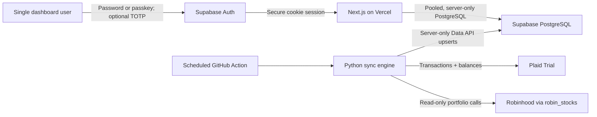

# Free Finance

Free Finance is an ultra-low-cost, single-tenant personal finance dashboard that
you deploy into accounts you control. It combines a Next.js dashboard on Vercel,
PostgreSQL on Supabase, and a small Python sync job on GitHub Actions.

The first supported data sources are:

- Bank, credit, loan, and other compatible accounts through Plaid Transactions
  and Balance
- Robinhood stocks and crypto through the community-maintained `robin_stocks`
  package

The target operating cost is **$0/month while the project remains within each
provider's free-tier limits**. Provider limits and terms can change, so check the
linked official pricing and plan pages before relying on that target.

> [!IMPORTANT]
> This source repository is intentionally public and designed to be forked.
> Public source is safe; public secrets are not. Every installer must keep their
> database URLs, service keys, provider tokens, owner user ID, and GitHub token in
> `.env.local` or encrypted deployment secrets—never in commits, screenshots,
> issues, Actions logs, or browser bundles.

## Project status

The initial end-to-end implementation is complete:

- [x] Step 1 — setup guide and environment contract
- [x] Step 2 — PostgreSQL schema, RLS, indexes, and Drizzle migrations
- [x] Step 3 — Plaid/Robinhood Python sync and GitHub Actions workflow
- [x] Step 4 — authenticated overview, detailed finance pages, charts, and theme

The dashboard is intentionally empty until a provider completes its first sync.

### Product tour

The overview stays deliberately simple: net worth and its trend, grouped
accounts, current-month cash flow, and recent activity. The navigation opens the
deeper tools only when they are needed:

- **Accounts** — balances, availability, connection health, and last sync time.
- **Transactions** — searchable and filterable history with account, category,
  pending status, and provider-supplied transaction time.
- **Subscriptions** — estimated recurring charges detected privately from
  merchant, amount consistency, and payment cadence.
- **Budgets** — editable monthly category limits compared with actual spending.
- **Investments** — portfolio allocation, equity totals, and individual
  stock/crypto holdings.
- **Reports** — six-month income, spending, cash-flow, and category trends.
- **Connections** and **Security** — provider status, manual sync, passkeys, and
  optional TOTP MFA.

Subscription detection is a local heuristic, not a paid enrichment service, so
it is intentionally labeled as an estimate. It does not call Plaid's optional
[Recurring Transactions endpoint](https://plaid.com/docs/api/products/transactions/#transactionsrecurringget).
The strict local defaults are:

- Non-annual matches require at least three recent charges; annual matches
  require two yearly renewals.
- Every recent interval must match the same cadence. A median interval alone is
  not enough.
- Every amount must stay within 3% or $0.25 of the median, whichever is larger.
- A stream disappears shortly after its next expected renewal is missed.
- Rent, loans, transfers, usage-based household bills, food, travel, ride
  shares, and ordinary repeat purchases are excluded from automatic detection.

You can dismiss an incorrect automatic match or create a manual subscription
from any synced debit and choose its frequency. Dismissals keep that stream
hidden across syncs; manual entries remain until you remove them. Both stay only
in your private Postgres database. Plaid supplies transaction times for only
some institutions and transaction types; when it returns only a posting date,
Free Finance displays **Time unavailable** instead of inventing an ordering.

## Architecture



The boundaries are intentional:

- Vercel receives the database runtime URL, publishable Supabase Auth
  configuration, the one allowed Auth user ID, and an optional repository-scoped
  token for the **Sync now** button. It does not receive bank or brokerage
  credentials.
- GitHub Actions receives the Plaid, Robinhood, and Supabase sync secrets.
- Browser code receives no financial-provider or database secrets.
- Drizzle uses Supabase's transaction pooler for short-lived Vercel functions.
- The Python job uses the Supabase Data API with a server-only secret key. This
  avoids direct PostgreSQL networking from ephemeral GitHub runners.
- Sync operations are idempotent upserts. A retry should update the same source
  records rather than create duplicates.

## Technology choices

| Layer | Choice | Reason |
| --- | --- | --- |
| Web | Next.js App Router + TypeScript | Server Components keep database access off the client |
| UI | Tailwind CSS + shadcn/ui | Small, local component surface with no hosted UI dependency |
| Charts | Recharts | Flexible charts without a paid service |
| Database | Supabase PostgreSQL | Managed PostgreSQL with a practical free tier |
| ORM | Drizzle ORM | Small SQL-first runtime and straightforward migrations |
| Sync | Python 3.12+ | First-class Plaid and `robin_stocks` libraries |
| Scheduler | GitHub Actions | Eight short syncs per day stay inexpensive |
| Hosting | Vercel | Zero-configuration Next.js deployments |

## Prerequisites

Create free accounts for:

- [GitHub](https://github.com/)
- [Supabase](https://database.new/)
- [Vercel](https://vercel.com/signup)
- [Plaid](https://dashboard.plaid.com/signup)

Install locally:

- Git
- Node.js 22 LTS or newer
- pnpm through Corepack
- Python 3.12 or newer
- GitHub CLI, optional but convenient
- Plaid CLI, optional for inspecting Plaid data

On macOS, the optional CLIs can be installed with:

```bash
brew install gh
brew install plaid/plaid-cli/plaid
```

## 1. Prepare local configuration

Fork this public template (or clone it directly), then create the untracked local
environment file:

```bash
git clone <your-fork-url>
cd free-finance
cp .env.example .env.local
```

The committed `.gitignore` excludes `.env.local`, Python virtual environments,
Robinhood session files, and Vercel's local project metadata.

## 2. Create the Supabase database

1. Open the [Supabase dashboard](https://database.new/) and create a project on
   the Free plan.
2. Choose the region nearest the Vercel region you expect to use.
3. Generate a strong database password and save it in a password manager. It is
   needed for both connection URLs.
4. Wait for the project to finish provisioning, then click **Connect** in the
   project dashboard.
5. Copy the **Transaction pooler** URI, which normally uses port `6543`, into
   `DATABASE_URL`.
6. Copy the **Session pooler** URI, which normally uses port `5432`, into
   `DATABASE_MIGRATION_URL`. The session pooler works from IPv4-only networks and
   supports migration tooling.
7. Open **Project Settings → API Keys**:
   - Copy the project URL into `SUPABASE_URL`.
   - Create or copy a server-side **Secret key** (`sb_secret_...`) into
     `SUPABASE_SECRET_KEY`.
   - If the project only exposes legacy keys, the legacy `service_role` value can
     be used temporarily in `SUPABASE_SECRET_KEY`.

Supabase recommends a transaction-mode pooler for temporary serverless
connections. Transaction mode does not support prepared statements, so the
Drizzle client added in Step 2 will explicitly disable them. See
[Supabase's connection guide](https://supabase.com/docs/guides/database/connecting-to-postgres)
and [API-key guide](https://supabase.com/docs/guides/getting-started/api-keys).

> [!CAUTION]
> `DATABASE_URL`, `DATABASE_MIGRATION_URL`, and `SUPABASE_SECRET_KEY` all grant
> privileged data access. The `sb_secret_...` and legacy `service_role` keys
> bypass Row Level Security. Never put them in a `NEXT_PUBLIC_` variable, browser
> component, screenshot, issue, or build log.

Create the tables:

```bash
corepack enable
pnpm install
pnpm db:migrate
```

Run migrations locally with `DATABASE_MIGRATION_URL`; do not run migrations in
every Vercel build or scheduled sync.

### Configure single-tenant Supabase Auth

Free Finance has no signup route. Each deployment accepts exactly one manually
provisioned Supabase user, and the server compares every authenticated session to
that user's immutable UUID.

1. Open **Authentication → Users → Add user → Create new user**.
2. Enter the owner's email and a unique password. Enable automatic email
   confirmation for this manually created account.
3. Copy the user's UUID into `DASHBOARD_USER_ID`.
4. Open **Project Settings → API Keys** and copy:
   - Project URL → both `NEXT_PUBLIC_SUPABASE_URL` and `SUPABASE_URL`.
   - Publishable key (`sb_publishable_...`) →
     `NEXT_PUBLIC_SUPABASE_PUBLISHABLE_KEY`.
   - Secret key (`sb_secret_...`) → `SUPABASE_SECRET_KEY`.
5. Under **Authentication → Sign In / Providers → Email**, disable public user
   signup. Also leave anonymous sign-ins and manual identity linking disabled.
6. Set the Auth **Site URL** to the final production URL and add redirect URLs
   for `https://your-domain.example/**` and `http://localhost:3000/**`.
7. Under **Authentication → Multi-Factor**, enable TOTP and the setting that
   limits first-factor-only sessions to 15 minutes.

The publishable URL and key are designed to be visible in browser code. They do
not bypass Row Level Security. `DASHBOARD_USER_ID`, database URLs, and the secret
key are server-only even though a UUID is not an authentication credential.

#### Optional passkeys

Passkeys are not forced. Password login always remains available.

1. Choose the final production or custom domain **before** anyone enrolls a
   passkey. Changing the relying-party ID later invalidates existing passkeys.
2. In Supabase's Passkeys settings, enable passkeys.
3. Set the relying-party ID to the hostname only, such as
   `finance.example.com`, and add the exact HTTPS origin, such as
   `https://finance.example.com`.
4. Deploy, sign in once with the Supabase password, open **Security**, and click
   **Add passkey**.

WebAuthn binds a passkey to the configured domain. A production relying-party ID
cannot also enroll from `localhost`; use the deployed HTTPS site for enrollment
or a separate local Supabase project. Supabase currently marks its
[passkey support as experimental](https://supabase.com/docs/guides/auth/passkeys),
so this repository pins a compatible client version and Dependabot proposes
updates for review.

#### Optional authenticator MFA

TOTP is also a per-user choice. The **Security** page can display a one-time QR
code and verify a six-digit code from 1Password, Authy, Google Authenticator, or
another compatible app. After at least one TOTP factor is verified, every new
password or passkey session must complete TOTP at AAL2. Removing the last factor
returns the account to password/passkey-only login.

Supabase does not provide TOTP recovery codes. Keep control of the Supabase
project, retain the password, and preferably register two passkeys before relying
on passwordless access. If locked out, the project owner can remove a factor or
reset the user from the Supabase dashboard. See
[Supabase's TOTP MFA guide](https://supabase.com/docs/guides/auth/auth-mfa/totp).

## 3. Set up Plaid and connect financial institutions

Plaid's current Trial plan provides free production API access for eligible
developers in the United States and Canada. It includes Transactions and Balance,
supports most major US and Canadian institutions, and allows up to 10 lifetime
production Items. Removing an Item does not return its slot. Review
[Plaid's Trial-plan details](https://support.plaid.com/hc/en-us/articles/39994173227159-What-is-the-Plaid-Trial-plan)
before creating test production Items.

Free Finance does not hardcode an institution. Plaid Link displays institutions
that support the required Transactions product in `PLAID_COUNTRY_CODES` and that
are enabled for your Plaid account. Plaid publishes a searchable
[institution coverage explorer](https://plaid.com/docs/institutions/).

### Start in Sandbox

1. Sign in to the [Plaid Dashboard](https://dashboard.plaid.com/).
2. Copy the client ID and Sandbox secret into:

   ```dotenv
   PLAID_CLIENT_ID=...
   PLAID_SECRET=...
   PLAID_ENV=sandbox
   PLAID_COUNTRY_CODES=US
   ```

3. Run the Plaid linking helper to create a Sandbox Item and write its
   access token to the private `PLAID_ACCESS_TOKENS` array in `.env.local`.
4. Run a manual sync and confirm that sample accounts and transactions reach
   Supabase before using a real account.

Sandbox Items cannot be moved to Production. They are disposable test data.

### Request Trial and connect real institutions

1. From the Plaid Dashboard, apply for the **Trial** plan and complete identity
   verification. The optional Plaid CLI command `plaid trial` opens the same
   application.
2. Wait for approval. Plaid says major-institution OAuth access commonly becomes
   available 6–24 hours after approval.
3. Fetch or copy the **Production** secret. With the Plaid CLI:

   ```bash
   plaid login
   plaid keys fetch
   plaid config set --env production
   ```

4. Update local configuration:

   ```dotenv
   PLAID_ENV=production
   PLAID_COUNTRY_CODES=US
   PLAID_CLIENT_ID=<your-client-id>
   PLAID_SECRET=<your-production-secret>
   ```

   Trial supports US and Canadian institutions. Use `US`, `CA`, or `US,CA`;
   country access on other Plaid plans depends on the regions approved for that
   Plaid account.

5. Connect one institution:

   ```bash
   .venv/bin/python scripts/plaid_link.py --github
   ```

   The helper will create a Hosted Link session, open it in a browser, let you
   select any compatible institution, exchange the one-time public token on the
   local machine, append the resulting Item credential to
   `PLAID_ACCESS_TOKENS`, and securely send the full credential array and
   matching Plaid configuration to GitHub Actions over standard input. Omit
   `--github` if GitHub CLI is not authenticated yet.

6. Repeat the same helper command for every additional institution. Existing
   Items are preserved and duplicate tokens are ignored.
7. Confirm all connections without printing access tokens:

   ```bash
   .venv/bin/python scripts/sync.py --source plaid --dry-run
   ```

Existing forks that already have `PLAID_ACCESS_TOKEN` can migrate without
reconnecting the institution:

```bash
.venv/bin/python scripts/plaid_link.py --migrate --github
```

Plaid access tokens are long-lived credentials and must remain server-side. Plaid
documents how requested products and countries determine which institutions
appear in its [Link API guide](https://plaid.com/docs/api/link/).

## 4. Configure Robinhood read-only sync

`robin_stocks` uses Robinhood's private, undocumented API. It is not an official
Robinhood integration, and login behavior can change without notice. This project
will call portfolio and holdings endpoints only; it will not include buy, sell,
transfer, or cancel-order operations.

1. Add the account credentials to `.env.local`. They are needed only on your
   computer for this one-time linking step:

   ```dotenv
   ROBINHOOD_USERNAME=<account-email>
   ROBINHOOD_PASSWORD=<account-password>
   ```

2. Start the local linking helper:

   ```bash
   python scripts/robinhood_link.py --github
   ```

3. Approve the new-device prompt in the Robinhood app. If Robinhood selects SMS
   or email verification instead, enter that one-time code in the terminal.
4. The helper validates the account, saves `ROBINHOOD_SESSION_B64` to
   `.env.local`, and sends that value to GitHub Actions over standard input. It
   does **not** send the username or password to GitHub.
5. Confirm that the session can read the account:

   ```bash
   python scripts/sync.py --source robinhood --dry-run
   ```

> [!WARNING]
> `ROBINHOOD_SESSION_B64` contains a bearer session. Base64 is transport encoding,
> not encryption, so protect this value like a password. The helper requests a
> 30-day session, but Robinhood can revoke or expire it earlier. When that
> happens, rerun the helper locally and approve a new login. The scheduled job never
> starts an interactive login and will not repeatedly send phone challenges.

The session approach follows the persistence mechanism implemented by
`robin_stocks`: a successful interactive login returns access and refresh tokens
plus a device token, which can be reused until Robinhood invalidates them. See
the library's [authentication source](https://github.com/jmfernandes/robin_stocks/blob/master/robin_stocks/robinhood/authentication.py)
and its open
[verification-workflow issue](https://github.com/jmfernandes/robin_stocks/issues/521).

Robinhood is optional. Leave `ROBINHOOD_SESSION_B64` empty to skip that source.

## 5. Add GitHub Actions secrets

The repository may remain public. GitHub Actions secrets are encrypted and are
not exposed to workflows triggered from another user's fork. On GitHub, open:

**Repository → Settings → Secrets and variables → Actions**

Create these **repository secrets**:

| Secret | Required | Source |
| --- | --- | --- |
| `SUPABASE_URL` | Yes | Supabase project URL |
| `SUPABASE_SECRET_KEY` | Yes | Supabase server-only secret key |
| `PLAID_CLIENT_ID` | Yes | Plaid Dashboard |
| `PLAID_SECRET` | Yes | Plaid Sandbox or Production secret |
| `PLAID_ACCESS_TOKENS` | Yes | Local Plaid linking helper |
| `ROBINHOOD_SESSION_B64` | No | Local Robinhood linking helper |

Create these **repository variables** under the Variables tab:

| Variable | Value |
| --- | --- |
| `PLAID_ENV` | `sandbox` during testing, then `production` for real institutions |
| `PLAID_COUNTRY_CODES` | Comma-separated Plaid regions such as `US` or `US,CA` |
| `APP_TIMEZONE` | An IANA timezone such as `America/New_York` |

GitHub documents the UI flow in
[Using secrets in GitHub Actions](https://docs.github.com/en/actions/how-tos/write-workflows/choose-what-workflows-do/use-secrets).

If GitHub CLI is authenticated for the repository, `gh secret set NAME` prompts
for a value without placing it directly in shell history:

```bash
gh secret set SUPABASE_URL
gh secret set SUPABASE_SECRET_KEY
gh secret set PLAID_CLIENT_ID
gh secret set PLAID_SECRET
gh secret set PLAID_ACCESS_TOKENS
gh variable set PLAID_ENV
gh variable set PLAID_COUNTRY_CODES
gh variable set APP_TIMEZONE
```

The Plaid and Robinhood helpers set their provider secrets automatically when
run with `--github`; do not paste credentials into a shell command. If setting
`PLAID_ACCESS_TOKENS` manually, its value must be a JSON array such as
`["access-production-..."]`. Verify names, not values:

```bash
gh secret list
gh variable list
```

1. Push it to the repository's default branch.
2. Open **Actions → Finance sync → Run workflow**.
3. Start with `PLAID_ENV=sandbox`.
4. Confirm the run summary and inspect Supabase table rows.
5. Switch `PLAID_ENV` to `production` only after Sandbox succeeds.

The workflow runs at minute 17 every three hours and also supports manual runs.
Scheduled workflows run from the default branch and can be delayed under GitHub
load; they are appropriate for a dashboard, not exact-time processing. See the
current
[GitHub schedule syntax](https://docs.github.com/en/actions/reference/workflows-and-actions/workflow-syntax#onschedule).

### Sync frequency and provider limits

Every three hours means eight runs per day. For each connected Plaid Item, a
normal run makes one real-time balance request and then incrementally consumes
available transaction changes. Plaid currently documents these Production
per-Item limits:

- `/accounts/balance/get`: 5 requests per minute and 30 per hour.
- `/transactions/sync`: 50 requests per minute.

The application is far below those limits, including occasional manual runs.
Plaid normally checks institutions for new transactions one to four times per
day, so a three-hour sync gives current balances but may not reveal a newly
pending transaction before Plaid has ingested it. This project does not call the
optional `/transactions/refresh` add-on. See Plaid's
[rate-limit table](https://plaid.com/docs/errors/rate-limit-exceeded/) and
[Transactions update guide](https://plaid.com/docs/transactions/webhooks/).

Robinhood does not publish a supported API or rate-limit contract for the
private endpoints used by `robin_stocks`. The dashboard therefore applies a
10-minute cooldown to manual requests, and GitHub Actions prevents overlapping
runs. Eight reads per day is deliberately conservative, but Robinhood can still
change or revoke access without notice.

## 6. Deploy to Vercel in under five minutes

This section assumes the database migration succeeded and the code is pushed to
GitHub. Plaid and Robinhood credentials do **not** go to Vercel.

1. Open the [Vercel dashboard](https://vercel.com/new).
2. Select **Add New → Project**, connect GitHub if needed, and import your fork.
3. Keep the detected framework as **Next.js** and the root directory as `.`.
4. Under **Environment Variables**, add only:

   | Variable | Vercel scope |
   | --- | --- |
   | `APP_NAME` | Production |
   | `APP_TIMEZONE` | Production |
   | `DATABASE_URL` | Production |
   | `NEXT_PUBLIC_SUPABASE_URL` | Production |
   | `NEXT_PUBLIC_SUPABASE_PUBLISHABLE_KEY` | Production |
   | `DASHBOARD_USER_ID` | Production |
   | `GITHUB_SYNC_REPOSITORY` | Production |
   | `GITHUB_SYNC_TOKEN` | Production |

5. Click **Deploy**.
6. Open the generated `vercel.app` URL and sign in using the email/password for
   the manually provisioned Supabase user.
7. Check `/setup` to confirm that the database is reachable and to see the last
   successful Plaid and Robinhood sync timestamps.
8. Open `/security` to optionally add passkeys and TOTP.

The final two variables enable the dashboard's **Sync now** button:

1. Create a fine-grained GitHub personal access token limited to this one
   repository.
2. Grant only **Actions: Read and write**; GitHub adds read-only metadata access.
3. Set `GITHUB_SYNC_REPOSITORY` to `owner/repository`.
4. Store the token as the sensitive Production-only `GITHUB_SYNC_TOKEN`.

GitHub's workflow-dispatch endpoint requires Actions write permission; the token
stays inside the Vercel Server Action and is never serialized to the browser.
See GitHub's
[workflow dispatch documentation](https://docs.github.com/en/rest/actions/workflows#create-a-workflow-dispatch-event).

Vercel supports zero-configuration Next.js deployment and automatically deploys
future pushes to the production branch. See
[Vercel's Next.js guide](https://vercel.com/docs/frameworks/full-stack/nextjs)
and [Git deployment guide](https://vercel.com/docs/git).

For this personal dashboard, keep production data out of Preview deployments by
leaving these variables scoped to **Production** only. If a Preview needs real
data, opt in deliberately and remember that environment-variable changes apply
only to new deployments. Vercel documents environment scoping in its
[environment-variable guide](https://vercel.com/docs/environment-variables).

## Environment variable reference

`.env.example` is the source of truth for names. This table explains where each
value belongs.

| Variable | Secret | Local | Vercel | GitHub Actions | Purpose |
| --- | --- | --- | --- | --- | --- |
| `APP_NAME` | No | Yes | Yes | No | Dashboard title |
| `APP_TIMEZONE` | No | Yes | Yes | No | Month boundaries and displayed timestamps |
| `DATABASE_URL` | Yes | Yes | Yes | No | Vercel/runtime transaction-pooler URI |
| `DATABASE_MIGRATION_URL` | Yes | Yes | No | No | Local migration session-pooler URI |
| `NEXT_PUBLIC_SUPABASE_URL` | No | Yes | Yes | No | Browser-safe Supabase Auth URL |
| `NEXT_PUBLIC_SUPABASE_PUBLISHABLE_KEY` | No | Yes | Yes | No | Browser-safe Auth key; RLS still applies |
| `DASHBOARD_USER_ID` | Private config | Yes | Yes | No | Exact allowed Supabase Auth user UUID |
| `GITHUB_SYNC_TOKEN` | Yes | Optional | Optional | No | Dispatches manual syncs server-side |
| `GITHUB_SYNC_REPOSITORY` | No | Optional | Optional | No | GitHub `owner/repository` target |
| `SUPABASE_URL` | Treat as config | Yes | No | Yes | Supabase Data API base URL |
| `SUPABASE_SECRET_KEY` | Yes | Yes | No | Yes | Server-only sync writes |
| `PLAID_ENV` | No | Yes | No | Variable | `sandbox` or `production` |
| `PLAID_COUNTRY_CODES` | No | Yes | No | Variable | Institution regions shown in Link |
| `PLAID_CLIENT_ID` | Yes | Yes | No | Yes | Plaid application identifier |
| `PLAID_SECRET` | Yes | Yes | No | Yes | Environment-specific Plaid secret |
| `PLAID_ACCESS_TOKENS` | Yes | Yes | No | Yes | JSON array of long-lived Item credentials |
| `PLAID_ACCESS_TOKEN` | Yes | Legacy only | No | Legacy only | Backward-compatible single Item credential |
| `ROBINHOOD_USERNAME` | Yes | Link only | No | No | One-time local Robinhood login |
| `ROBINHOOD_PASSWORD` | Yes | Link only | No | No | One-time local Robinhood login |
| `ROBINHOOD_SESSION_B64` | Yes | Optional | No | Optional | Reusable read-only sync session |
| `LOG_LEVEL` | No | Yes | No | Workflow default | Python log verbosity |

Only the two explicitly named Supabase publishable values use `NEXT_PUBLIC_`.
Never add that prefix to a database URL, secret key, provider credential, GitHub
token, or owner ID.

## Local commands

```bash
# Install the web application
corepack enable
pnpm install

# Apply PostgreSQL migrations
pnpm db:migrate

# Start the dashboard
pnpm dev

# Create the Python environment
python3 -m venv .venv
source .venv/bin/activate
python -m pip install --upgrade pip
python -m pip install -r scripts/requirements.txt

# Link one or more Plaid Items and test each source without writes
python scripts/plaid_link.py --github
# Repeat the previous command to add another institution
python scripts/sync.py --source plaid --dry-run
python scripts/robinhood_link.py --github
python scripts/sync.py --source robinhood --dry-run

# Run the real sync
python scripts/sync.py
```

Next.js loads `.env.local` automatically. Standalone Python scripts do not, so
the Step 3 scripts will load the repository's `.env.local` explicitly for local
development while using injected environment variables in GitHub Actions.

## Security and operating notes

- A public repository is supported and is the intended distribution model. Keep
  `.env.local` ignored and store all per-instance credentials in GitHub,
  Supabase, or Vercel secret managers.
- Restrict Vercel's GitHub App and any fine-grained token to the smallest
  practical repository and permission set.
- Protect GitHub, Supabase, Vercel, Plaid, Robinhood, and your password manager
  with MFA.
- Do not paste secrets into command arguments, commit messages, screenshots, or
  support tickets. Prompted CLI input is safer than inline values.
- Rotate a key immediately if it appears in Git history or logs. Deleting the
  local file is not enough after a secret has been committed.
- Keep the Supabase password unique. Auth sessions use secure, HTTP-only cookies,
  and every protected server path revalidates the user and exact owner UUID.
- Public signup is disabled. Passkeys and TOTP are opt-in; an enrolled TOTP
  factor is then enforced for future sessions.
- Set a 12-character-or-longer password in Supabase. Leaked-password screening
  is plan-dependent; if the dashboard does not offer it on the Free plan, use a
  password manager to generate a unique password and prefer a passkey.
- Financial tables have Row Level Security enabled with no browser policies or
  grants. Only the server database connection and sync secret can read them.
- Production responses use a nonce-based Content Security Policy, HSTS,
  anti-framing, no-store caching, and restrictive browser permissions.
- The Python process will redact known secret values and avoid logging full bank
  account numbers, Plaid tokens, or Robinhood responses.
- The app is a tracker, not an execution platform. No money movement or trading
  code belongs in the sync engine.
- Export the PostgreSQL data periodically. A free hosted database should not be
  the only copy of long-term financial history.

## Troubleshooting

### An institution is not visible in Plaid Link

Confirm that `PLAID_ENV`, its matching secret, and `PLAID_COUNTRY_CODES` describe
the Plaid access enabled for the fork. Link only shows institutions that support
the required Transactions product in the requested countries. Trial is limited
to US and Canadian institutions, and newly approved OAuth institutions may take
6–24 hours to appear.

### Plaid reports `INVALID_API_KEYS`

Plaid secrets are environment-specific. If `PLAID_ENV=production`, use the
Production secret shown after Trial approval; a Sandbox secret will be rejected.
For disposable test data, pair the Sandbox secret with `PLAID_ENV=sandbox`.

### Plaid reports `ITEM_LOGIN_REQUIRED`

The institution connection needs user attention. Re-run the linking helper in
update mode after Step 3 and manually rerun the workflow:

```bash
# N is the 1-based position in PLAID_ACCESS_TOKENS.
.venv/bin/python scripts/plaid_link.py --update --item-index N --github
```

Plaid update mode keeps the existing access token; the helper republishes the
unchanged credential array after the repair succeeds.

### Transactions on the same date have no time

Plaid's standard transaction object always includes a posting date, but its
`datetime` and `authorized_datetime` fields are optional and institution
dependent. New syncs preserve either timestamp when available. If the institution
returns only the date, the dashboard shows **Time unavailable** and uses a stable
fallback order rather than implying that one transaction happened before another.

### Supabase returns `401` or permission errors

Confirm that `SUPABASE_SECRET_KEY` contains a server-side `sb_secret_...` key or
legacy `service_role` key—not a publishable or legacy `anon` key. Also confirm
that the key and `SUPABASE_URL` belong to the same project.

### PostgreSQL fails only on Vercel

Confirm that `DATABASE_URL` is the transaction-pooler URI on port `6543`, not the
IPv6-only direct connection. If the password contains reserved URL characters,
copy the generated URI from Supabase's Connect dialog or URL-encode the password.

### Robinhood reports that its session expired

Run `python scripts/robinhood_link.py --github` on your computer, approve the
new Robinhood app notification or enter the SMS code, then manually rerun the
workflow. Do not attempt to paste a one-time SMS code into GitHub secrets; the
linking helper converts the approved login into the reusable session.

### The scheduled Action did not run

Confirm that `sync.yml` exists on the default branch and the workflow is enabled.
GitHub may delay scheduled runs. Public repositories also have inactivity rules,
so GitHub can disable a schedule after an extended period without repository
activity. Re-enable it from the Actions tab if needed; manual runs still provide
a quick verification.

## Repository layout

```text
.
├── src/
│   ├── app/                    # Next.js App Router pages and actions
│   ├── components/             # shadcn/ui and dashboard components
│   ├── db/                     # Drizzle schema and lazy database client
│   └── lib/                    # Auth, overview/detail queries, and formatting
├── drizzle/                    # Versioned PostgreSQL migrations
├── scripts/
│   ├── plaid_config.py         # Multi-Item and country configuration parser
│   ├── plaid_link.py           # Add or repair local Plaid Items
│   ├── robinhood_link.py       # One-time SMS/app approval bootstrap
│   ├── sync.py                 # Idempotent scheduled sync
│   ├── test_sync.py            # Provider normalization unit tests
│   └── requirements.txt
├── .github/workflows/sync.yml  # Three-hour and manual GitHub Action
├── .env.example
└── README.md
```

## Disclaimer

This is an independent personal project, not financial advice, and is not
affiliated with Plaid, Robinhood, Supabase, Vercel, or GitHub.
`robin_stocks` relies on an unofficial API and may stop working at any time. Use
the software at your own risk and review the terms that apply to each connected
account.
